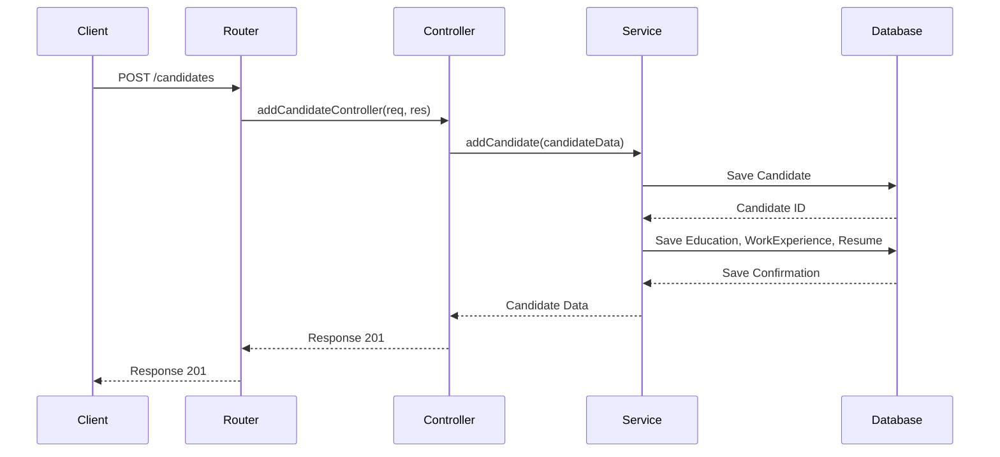
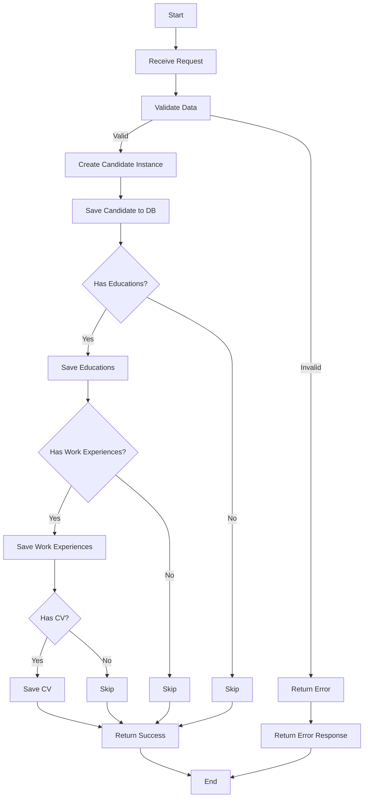

### Documentación del Proyecto Backend

#### 1. Tecnologías y Arquitectura del Proyecto

**Tecnologías Utilizadas:**
- **Lenguajes de Programación:** TypeScript, JavaScript
- **Frameworks:** Express.js
- **Base de Datos:** PostgreSQL
- **ORM:** Prisma
- **Herramientas de Construcción:** TypeScript Compiler (tsc)
- **Gestión de Dependencias:** npm
- **Pruebas:** Jest
- **Middleware:** Multer (para la carga de archivos), CORS
- **Configuración de Entorno:** dotenv
- **Documentación API:** Swagger (swagger-jsdoc, swagger-ui-express)
- **Linting y Formateo:** ESLint, Prettier

**Arquitectura General:**
El proyecto sigue una arquitectura de capas que separa las responsabilidades en diferentes módulos. Las capas principales incluyen:

- **Rutas (Routes):** Define los puntos de entrada para las solicitudes HTTP.
- **Controladores (Controllers):** Gestionan la lógica de negocio y coordinan las solicitudes entre las rutas y los servicios.
- **Servicios (Services):** Contienen la lógica de negocio principal y se encargan de interactuar con la base de datos a través de Prisma.
- **Modelos (Models):** Representan las entidades de la base de datos y encapsulan la lógica de persistencia.
- **Validadores (Validators):** Validan los datos de entrada antes de procesarlos.

#### 2. Estructura de Carpetas y Archivos

```
AI4Devs-tdd-JDCH/
│
├── backend/
│   ├── dist/
│   │   ├── application/
│   │   │   ├── services/
│   │   │   ├── validator.js
│   │   ├── domain/
│   │   │   ├── models/
│   │   ├── presentation/
│   │   │   ├── controllers/
│   │   ├── routes/
│   │   ├── index.js
│   ├── prisma/
│   │   ├── migrations/
│   │   ├── schema.prisma
│   ├── src/
│   │   ├── application/
│   │   │   ├── services/
│   │   │   ├── validator.ts
│   │   ├── domain/
│   │   │   ├── models/
│   │   ├── presentation/
│   │   │   ├── controllers/
│   │   ├── routes/
│   │   ├── index.ts
│   ├── .env
│   ├── .eslintrc.js
│   ├── .prettierrc
│   ├── api-spec.yaml
│   ├── jest.config.js
│   ├── package.json
│
```

**Descripción de Archivos y Directorios Relevantes:**

- **dist/**: Contiene los archivos JavaScript compilados a partir de TypeScript.
- **src/**: Contiene el código fuente del proyecto.
  - **application/services/**: Implementa la lógica de negocio y las interacciones con la base de datos.
  - **domain/models/**: Define las entidades de la base de datos y sus métodos de persistencia.
  - **presentation/controllers/**: Gestiona las solicitudes HTTP y coordina con los servicios.
  - **routes/**: Define las rutas de la API.
  - **index.ts**: Punto de entrada principal de la aplicación.
- **prisma/**: Contiene la configuración de Prisma, incluyendo el esquema de la base de datos.
- **.env**: Archivo de configuración de variables de entorno.
- **api-spec.yaml**: Especificación de la API en formato OpenAPI.
- **package.json**: Define las dependencias y scripts del proyecto.
- **.eslintrc.js** y **.prettierrc**: Configuración de ESLint y Prettier para el linting y formateo del código.

#### 3. Diagramas Técnicos

**Diagrama de Secuencia:**



**Diagrama de Flujo:**



Estos diagramas proporcionan una visión clara del flujo de datos y procesos dentro del sistema, desde la recepción de una solicitud hasta la interacción con la base de datos y la respuesta al cliente.
