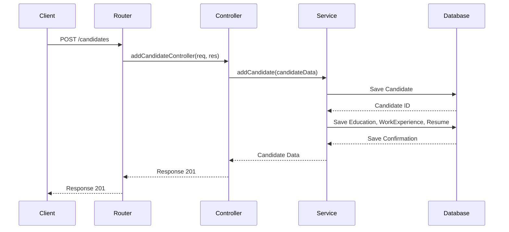
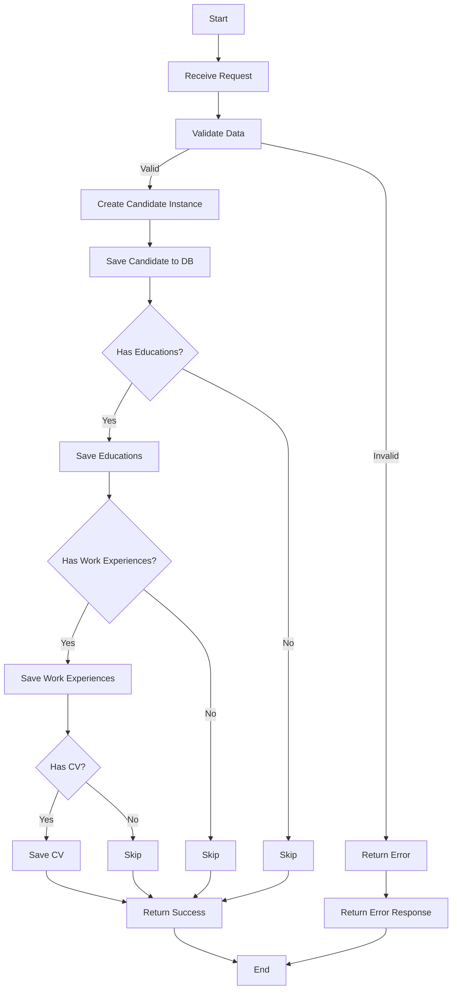

# Prompts Iniciales


## Jeferson: 

### **Rol Asignado:**  
Eres un **arquitecto de software especializado en backend** con experiencia en documentación técnica y generación de diagramas de arquitectura.  

### **Instrucciones:**  
Necesito una documentación detallada sobre el estado actual del proyecto ** @backend  **, que incluya:  

#### **1. Tecnologías y Arquitectura del Proyecto:**  
- Lista de tecnologías utilizadas (frameworks, lenguajes, bases de datos, etc.).  
- Descripción de la arquitectura general del proyecto.  

#### **2. Estructura de Carpetas y Archivos:**  
- Mapa detallado de la estructura de archivos y carpetas del proyecto.  
- Explicación del propósito de cada archivo o directorio relevante.  

#### **3. Diagramas Técnicos:**  
Debes generar los siguientes diagramas en **formato Mermaid**:  
- **Diagrama de secuencia:** Debe mostrar el flujo de la petición desde el punto de entrada hasta la base de datos.  
- **Diagrama de flujo:** Debe representar el proceso interno de cada servicio, detallando cómo se manejan las peticiones y las interacciones con la base de datos.  

### **Formato de Entrega:**  
- Documento estructurado con secciones claras.  
- Diagramas en formato Mermaid listos para ser renderizados.  
- Explicaciones concisas y bien organizadas.  


---

## IA:

### Documentación del Proyecto Backend

#### 1. Tecnologías y Arquitectura del Proyecto

**Tecnologías Utilizadas:**
- **Lenguajes de Programación:** TypeScript, JavaScript
- **Frameworks:** Express.js
- **Base de Datos:** PostgreSQL
- **ORM:** Prisma
- **Herramientas de Construcción:** TypeScript Compiler (tsc)
- **Gestión de Dependencias:** npm
- **Pruebas:** Jest
- **Middleware:** Multer (para la carga de archivos), CORS
- **Configuración de Entorno:** dotenv
- **Documentación API:** Swagger (swagger-jsdoc, swagger-ui-express)
- **Linting y Formateo:** ESLint, Prettier

**Arquitectura General:**
El proyecto sigue una arquitectura de capas que separa las responsabilidades en diferentes módulos. Las capas principales incluyen:

- **Rutas (Routes):** Define los puntos de entrada para las solicitudes HTTP.
- **Controladores (Controllers):** Gestionan la lógica de negocio y coordinan las solicitudes entre las rutas y los servicios.
- **Servicios (Services):** Contienen la lógica de negocio principal y se encargan de interactuar con la base de datos a través de Prisma.
- **Modelos (Models):** Representan las entidades de la base de datos y encapsulan la lógica de persistencia.
- **Validadores (Validators):** Validan los datos de entrada antes de procesarlos.

#### 2. Estructura de Carpetas y Archivos

```
AI4Devs-tdd-JDCH/
│
├── backend/
│   ├── dist/
│   │   ├── application/
│   │   │   ├── services/
│   │   │   ├── validator.js
│   │   ├── domain/
│   │   │   ├── models/
│   │   ├── presentation/
│   │   │   ├── controllers/
│   │   ├── routes/
│   │   ├── index.js
│   ├── prisma/
│   │   ├── migrations/
│   │   ├── schema.prisma
│   ├── src/
│   │   ├── application/
│   │   │   ├── services/
│   │   │   ├── validator.ts
│   │   ├── domain/
│   │   │   ├── models/
│   │   ├── presentation/
│   │   │   ├── controllers/
│   │   ├── routes/
│   │   ├── index.ts
│   ├── .env
│   ├── .eslintrc.js
│   ├── .prettierrc
│   ├── api-spec.yaml
│   ├── jest.config.js
│   ├── package.json
│
```

**Descripción de Archivos y Directorios Relevantes:**

- **dist/**: Contiene los archivos JavaScript compilados a partir de TypeScript.
- **src/**: Contiene el código fuente del proyecto.
  - **application/services/**: Implementa la lógica de negocio y las interacciones con la base de datos.
  - **domain/models/**: Define las entidades de la base de datos y sus métodos de persistencia.
  - **presentation/controllers/**: Gestiona las solicitudes HTTP y coordina con los servicios.
  - **routes/**: Define las rutas de la API.
  - **index.ts**: Punto de entrada principal de la aplicación.
- **prisma/**: Contiene la configuración de Prisma, incluyendo el esquema de la base de datos.
- **.env**: Archivo de configuración de variables de entorno.
- **api-spec.yaml**: Especificación de la API en formato OpenAPI.
- **package.json**: Define las dependencias y scripts del proyecto.
- **.eslintrc.js** y **.prettierrc**: Configuración de ESLint y Prettier para el linting y formateo del código.

#### 3. Diagramas Técnicos

**Diagrama de Secuencia:**



**Diagrama de Flujo:**



Estos diagramas proporcionan una visión clara del flujo de datos y procesos dentro del sistema, desde la recepción de una solicitud hasta la interacción con la base de datos y la respuesta al cliente.


---

## Jeferson: 

### **Rol Asignado:**  
Eres un **ingeniero de software especializado en pruebas unitarias** con experiencia en buenas prácticas de testing y diseño de pruebas estructuradas.  

### **Contexto:**  
Necesito generar un documento detallado que sirva como guía para la implementación de pruebas unitarias del servicio `addCandidate`. Estas pruebas se desarrollarán en el archivo **`@tests-iniciales.test.ts`** y deben seguir buenas prácticas de testing.  

### **Requisitos del Documento:**  

#### **1. Resumen General del Proceso de Testing**  
- Explicación del propósito de las pruebas unitarias para `addCandidate`.  
- Objetivo general y objetivos principales de las pruebas.  

#### **2. Buenas Prácticas a Aplicar y Justificación**  
Incluye una sección detallada explicando las buenas prácticas que se utilizarán, junto con su justificación:  
- **Convención de nombres:** Establecer nombres claros y descriptivos para las pruebas.  
- **Patrón Arrange-Act-Assert (AAA):** Explicar cómo organizar el código de prueba siguiendo este patrón.  
- **Parametrización de pruebas:** Evitar duplicación de código utilizando valores dinámicos para pruebas similares.  
- **Mensajes de afirmación:** Garantizar que los mensajes de error sean descriptivos y ayuden a la depuración.  
- **Pruebas de casos límite:** Validar escenarios extremos y asegurar robustez en la función `addCandidate`.  

#### **3. Diseño de Pruebas**  
Dado que hay dos principales áreas de prueba, estas deben estar organizadas de manera separada:  

##### **A. Pruebas de Recepción de Datos del Formulario**  
- Explicación de los **caminos felices** (ejemplo: todos los datos válidos y completos).  
- Explicación de los **caminos no felices** (ejemplo: datos faltantes, tipos incorrectos, valores fuera de rango).  
- Definición de nombres de prueba y su justificación.  

##### **B. Pruebas de Guardado en Base de Datos**  
- Explicación de los **caminos felices** (ejemplo: los datos se almacenan correctamente y se retorna un ID).  
- Explicación de los **caminos no felices** (ejemplo: fallo en la conexión a la base de datos, valores duplicados, violaciones de constraints).  
- Definición de nombres de prueba y su justificación.  

### **Restricción Importante:**  
🚨 **No generes código aún.** Estamos en fase de análisis, por lo que solo se requiere la documentación y planificación.  


---

## IA:

### Guía para la Implementación de Pruebas Unitarias del Servicio `addCandidate`

#### 1. Resumen General del Proceso de Testing

**Propósito de las Pruebas Unitarias:**
Las pruebas unitarias para el servicio `addCandidate` tienen como objetivo verificar que la función se comporte correctamente bajo diferentes condiciones. Estas pruebas aseguran que el servicio maneje adecuadamente la entrada de datos y la interacción con la base de datos, garantizando la calidad y fiabilidad del código.

**Objetivo General:**
El objetivo general es validar que el servicio `addCandidate` funcione según lo esperado, manejando correctamente tanto los casos de éxito como los de error.

**Objetivos Principales:**
- Verificar que el servicio procese correctamente los datos de entrada.
- Asegurar que los datos se guarden correctamente en la base de datos.
- Identificar y manejar adecuadamente los errores y excepciones.

#### 2. Buenas Prácticas a Aplicar y Justificación

**Convención de Nombres:**
- Utilizar nombres claros y descriptivos para las pruebas, como `shouldAddCandidateWithValidData` o `shouldReturnErrorForMissingName`.
- Justificación: Nombres claros facilitan la comprensión del propósito de cada prueba y mejoran la mantenibilidad del código.

**Patrón Arrange-Act-Assert (AAA):**
- **Arrange:** Configurar el entorno de prueba y preparar los datos necesarios.
- **Act:** Ejecutar la función que se está probando.
- **Assert:** Verificar que el resultado sea el esperado.
- Justificación: Este patrón organiza el código de prueba de manera clara y estructurada, facilitando la lectura y comprensión.

**Parametrización de Pruebas:**
- Utilizar frameworks de testing que soporten la parametrización para evitar la duplicación de código.
- Justificación: Permite probar múltiples escenarios con diferentes conjuntos de datos sin duplicar el código, mejorando la eficiencia y cobertura de las pruebas.

**Mensajes de Afirmación:**
- Asegurar que los mensajes de error sean descriptivos, como `Expected candidate to be added successfully, but it failed`.
- Justificación: Mensajes claros ayudan a identificar rápidamente la causa de un fallo en las pruebas, facilitando la depuración.

**Pruebas de Casos Límite:**
- Incluir pruebas para escenarios extremos, como campos vacíos o valores máximos permitidos.
- Justificación: Validar casos límite asegura que la función sea robusta y maneje adecuadamente situaciones inesperadas.

#### 3. Diseño de Pruebas

##### A. Pruebas de Recepción de Datos del Formulario

**Caminos Felices:**
- **Descripción:** Verificar que el servicio procese correctamente todos los datos válidos y completos.
- **Ejemplo de Nombre de Prueba:** `shouldAddCandidateWithValidData`
- **Justificación:** Asegura que el servicio funcione correctamente con datos ideales.

**Caminos No Felices:**
- **Descripción:** Probar escenarios con datos faltantes, tipos incorrectos o valores fuera de rango.
- **Ejemplo de Nombre de Prueba:** `shouldReturnErrorForMissingName`
- **Justificación:** Garantiza que el servicio maneje adecuadamente los errores de entrada.

##### B. Pruebas de Guardado en Base de Datos

**Caminos Felices:**
- **Descripción:** Verificar que los datos se almacenen correctamente y se retorne un ID.
- **Ejemplo de Nombre de Prueba:** `shouldSaveCandidateAndReturnId`
- **Justificación:** Asegura que la interacción con la base de datos sea exitosa.

**Caminos No Felices:**
- **Descripción:** Probar fallos en la conexión a la base de datos, valores duplicados o violaciones de constraints.
- **Ejemplo de Nombre de Prueba:** `shouldHandleDatabaseConnectionFailure`
- **Justificación:** Asegura que el servicio maneje adecuadamente los errores de base de datos.

Esta guía proporciona una estructura clara para la implementación de pruebas unitarias, asegurando que el servicio `addCandidate` sea probado exhaustivamente y cumpla con los estándares de calidad.


---

## Jeferson: 

### **Actualización del Diseño de Pruebas: Mocking de Base de Datos**  

En base a lo mencionado anteriormente, es importante considerar lo siguiente:  

🔹 **Si alguno de los tests requiere modificar algo en la base de datos, se debe utilizar mocking.**  
- Las pruebas unitarias no deben interactuar directamente con la base de datos real.  
- Se debe **mockear Prisma Client** para simular el comportamiento de la base de datos sin afectar datos reales.  
- Para este caso específico, puedes consultar la documentación oficial de Prisma:  
  📌 [Guía de Mocking de Prisma](https://www.prisma.io/blog/testing-series-1-8eRB5p0Y8o#mock-prisma-client)  

### **Modificación del Punto B: Pruebas de Guardado en Base de Datos**  
El punto **"B. Pruebas de Guardado en Base de Datos"** debe actualizarse para:  
1. **Incluir la estrategia de mocking** en la implementación de las pruebas.  
2. **Asegurar que no se alteren datos reales** al ejecutar los tests.  
3. **Seguir las prácticas recomendadas en la documentación de Prisma** para un correcto uso de mocks.  

Con esta actualización, el diseño de pruebas será más sólido y alineado con buenas prácticas en testing.  


---

## IA:

### Actualización del Diseño de Pruebas: Mocking de Base de Datos

#### B. Pruebas de Guardado en Base de Datos (Actualizado)

**Estrategia de Mocking:**

Para asegurar que las pruebas unitarias no interactúen con la base de datos real, se debe utilizar el mocking del Prisma Client. Esto permite simular el comportamiento de la base de datos y verificar la lógica de negocio sin afectar los datos reales.

**Pasos para Implementar Mocking:**

1. **Configurar el Mock de Prisma Client:**
   - Utilizar herramientas como `jest.mock` para interceptar las llamadas al Prisma Client.
   - Crear un mock del cliente que simule las respuestas esperadas de la base de datos.

2. **Simular Respuestas de la Base de Datos:**
   - Definir cómo debe comportarse el mock para diferentes escenarios, como la inserción exitosa de un candidato o el manejo de errores de conexión.
   - Ejemplo: Simular que el método `create` de Prisma devuelve un ID de candidato al guardar correctamente.

3. **Asegurar que no se Alteren Datos Reales:**
   - Verificar que todas las interacciones con la base de datos en las pruebas sean a través del mock.
   - Asegurarse de que no se realicen llamadas reales a la base de datos durante las pruebas.

4. **Seguir las Prácticas Recomendadas por Prisma:**
   - Consultar la [Guía de Mocking de Prisma](https://www.prisma.io/blog/testing-series-1-8eRB5p0Y8o#mock-prisma-client) para obtener ejemplos y mejores prácticas.
   - Implementar los mocks de acuerdo con las recomendaciones para asegurar un comportamiento consistente y predecible.

**Caminos Felices (Actualizado):**
- **Descripción:** Verificar que los datos se almacenen correctamente utilizando el mock y se retorne un ID simulado.
- **Ejemplo de Nombre de Prueba:** `shouldSaveCandidateAndReturnIdUsingMock`
- **Justificación:** Asegura que la lógica de negocio funcione correctamente sin depender de la base de datos real.

**Caminos No Felices (Actualizado):**
- **Descripción:** Probar fallos simulados en la conexión a la base de datos o violaciones de constraints utilizando el mock.
- **Ejemplo de Nombre de Prueba:** `shouldHandleDatabaseConnectionFailureUsingMock`
- **Justificación:** Asegura que el servicio maneje adecuadamente los errores simulados de base de datos.

Con esta actualización, las pruebas de guardado en base de datos serán más robustas y seguras, alineándose con las mejores prácticas de testing al utilizar mocks para simular el comportamiento de la base de datos.


---

## Jeferson: 

**NOTA:** En este punto cambie el modelo de IA a claude 3.5-sonnet.

---

### **Objetivo:**  
Generar un documento detallado que describa **las fases necesarias** para implementar las pruebas unitarias de:  
- **A. Pruebas de Recepción de Datos del Formulario**  
- **B. Pruebas de Guardado en Base de Datos (con mocking de Prisma)**  

El documento debe estar diseñado para que el equipo de desarrollo pueda entenderlo y aplicarlo fácilmente.  

---

### **Requisitos del Documento:**  

#### **1. Fases de Implementación**  
Cada fase debe estar **claramente descrita** e incluir:  
- **Objetivo de la fase** (qué se pretende lograr).  
- **Acciones específicas a realizar** sobre el proyecto actual.  
- **Ejemplos concretos** de implementación.  
- **Buenas prácticas** recomendadas.  

#### **2. Análisis del Proyecto @backend**  
Antes de definir las fases, es crucial **analizar detalladamente** los archivos del proyecto para:  
- Identificar si se requiere **alguna instalación o configuración previa** antes de iniciar las pruebas.  
- Determinar si existen **dependencias** que deban ser consideradas en la implementación.  

#### **3. Buenas Prácticas de Documentación**  
El documento debe ser:  
- **Claro y estructurado**, con títulos y subtítulos bien definidos.  
- **Fácil de entender**, en especial para el equipo de desarrollo.  
- **Accesible y práctico**, con ejemplos aplicables al proyecto actual.  


---

## IA:

# Plan de Implementación de Pruebas Unitarias para Backend

## 1. Análisis Inicial del Proyecto

### 1.1 Configuración Actual
El proyecto ya cuenta con:
- Jest configurado en `jest.config.js`
- TypeScript configurado
- Prisma como ORM
- Express como framework web

### 1.2 Dependencias Necesarias Adicionales
```bash
npm install --save-dev @types/jest jest ts-jest @types/supertest supertest jest-mock-extended
```

## 2. Fases de Implementación

### Fase 1: Configuración del Entorno de Pruebas

#### Objetivo
Preparar el ambiente para ejecutar pruebas unitarias aisladas.

#### Acciones
1. Crear directorio de pruebas:
```bash
mkdir -p src/__tests__/unit
```

2. Configurar Mock de Prisma - Crear archivo `src/__tests__/utils/prisma.mock.ts`:
```typescript
import { PrismaClient } from '@prisma/client';
import { mockDeep, DeepMockProxy } from 'jest-mock-extended';

export type Context = {
  prisma: PrismaClient;
};

export type MockContext = {
  prisma: DeepMockProxy<PrismaClient>;
};

export const createMockContext = (): MockContext => {
  return {
    prisma: mockDeep<PrismaClient>(),
  };
};
```

### Fase 2: Pruebas de Validación de Datos

#### Objetivo
Verificar que las validaciones del formulario funcionan correctamente.

#### Acciones
1. Crear archivo `src/__tests__/unit/validator.test.ts`:
```typescript
import { validateCandidateData } from '../../application/validator';

describe('Validator Tests', () => {
  describe('validateCandidateData', () => {
    test('debería validar datos correctos del candidato', () => {
      const validData = {
        firstName: 'Juan',
        lastName: 'Pérez',
        email: 'juan@example.com',
        phone: '666777888',
        address: 'Calle Principal 123'
      };
      
      expect(() => validateCandidateData(validData)).not.toThrow();
    });

    test('debería rechazar email inválido', () => {
      const invalidData = {
        firstName: 'Juan',
        lastName: 'Pérez',
        email: 'correo-invalido',
        phone: '666777888',
        address: 'Calle Principal 123'
      };
      
      expect(() => validateCandidateData(invalidData)).toThrow('Invalid email');
    });
  });
});
```

### Fase 3: Pruebas del Servicio de Candidatos

#### Objetivo
Verificar la lógica de negocio para el manejo de candidatos.

#### Acciones
1. Crear archivo `src/__tests__/unit/candidateService.test.ts`:
```typescript
import { addCandidate } from '../../application/services/candidateService';
import { createMockContext, MockContext } from '../utils/prisma.mock';
import { PrismaClient } from '@prisma/client';

jest.mock('@prisma/client');

let mockContext: MockContext;
let prisma: PrismaClient;

beforeEach(() => {
  mockContext = createMockContext();
  prisma = mockContext.prisma;
});

describe('Candidate Service Tests', () => {
  test('debería crear un candidato exitosamente', async () => {
    const candidateData = {
      firstName: 'María',
      lastName: 'García',
      email: 'maria@example.com',
      phone: '666777888',
      address: 'Avenida Principal 456'
    };

    mockContext.prisma.candidate.create.mockResolvedValue({
      id: 1,
      ...candidateData
    });

    const result = await addCandidate(candidateData);
    
    expect(result).toHaveProperty('id', 1);
    expect(result.email).toBe(candidateData.email);
  });

  test('debería manejar error de email duplicado', async () => {
    const candidateData = {
      firstName: 'Ana',
      lastName: 'López',
      email: 'ana@example.com',
      phone: '666999888'
    };

    mockContext.prisma.candidate.create.mockRejectedValue({
      code: 'P2002',
      message: 'Unique constraint failed on the fields: (`email`)'
    });

    await expect(addCandidate(candidateData))
      .rejects
      .toThrow('The email already exists in the database');
  });
});
```

### Fase 4: Pruebas de Integración de Endpoints

#### Objetivo
Verificar la correcta integración entre controladores y servicios.

#### Acciones
1. Crear archivo `src/__tests__/integration/candidates.test.ts`:
```typescript
import request from 'supertest';
import { app } from '../../index';
import { PrismaClient } from '@prisma/client';
import { mockDeep } from 'jest-mock-extended';

jest.mock('@prisma/client');

const prisma = mockDeep<PrismaClient>();

describe('Candidate Endpoints', () => {
  test('POST /candidates debería crear un nuevo candidato', async () => {
    const candidateData = {
      firstName: 'Pedro',
      lastName: 'Sánchez',
      email: 'pedro@example.com',
      phone: '666555444',
      address: 'Plaza Mayor 789'
    };

    const response = await request(app)
      .post('/candidates')
      .send(candidateData)
      .expect(201);

    expect(response.body).toHaveProperty('message', 'Candidate added successfully');
    expect(response.body.data).toHaveProperty('email', candidateData.email);
  });
});
```

## 3. Buenas Prácticas

### 3.1 Organización de Pruebas
- Mantener una estructura clara de directorios (`unit`, `integration`)
- Usar nombres descriptivos para los archivos de prueba
- Agrupar pruebas relacionadas en bloques `describe`

### 3.2 Mocking
- Usar mocks para aislar las pruebas de la base de datos
- Implementar mocks específicos para cada caso de prueba
- Limpiar los mocks después de cada prueba

### 3.3 Aserciones
- Usar aserciones específicas y descriptivas
- Verificar tanto casos exitosos como casos de error
- Incluir mensajes descriptivos en las aserciones

## 4. Ejecución de Pruebas

Para ejecutar las pruebas:
```bash
npm test                 # Ejecutar todas las pruebas
npm test -- --watch     # Modo watch
npm test -- --coverage  # Generar reporte de cobertura
```


## Jeferson:

**NOTA:** En este punto continue trabajando con el modelo de IA claude 3.5-sonnet, pero usando la herrramienta Composer de Cursor para generar el código.

---

### **Objetivo:**  
Utilizando el documento **`@documento-guia.md`** como referencia, debemos comenzar con la implementación de las fases descritas en **`@implementacion-pruebas.md`** para la creación de pruebas unitarias.  

### **Proceso de Implementación:**  
🔹 La implementación se realizará de manera **iterativa**, revisando fase por fase.  
🔹 Los cambios solo se aplicarán si han sido **revisados y aprobados**.  

### **Instrucciones:**  
1. **Antes de iniciar la implementación**, realiza todas las preguntas necesarias para aclarar cualquier posible duda y obtener un mayor contexto.  
2. Si no hay dudas pendientes, genera un documento que contenga:  
   - **Un resumen breve** de la finalidad de esta implementación.  
   - **Un paso a paso detallado** de cómo se llevará a cabo el proceso.  

### **Restricción Importante:**  
🚨 **No generes código aún.** Solo nos enfocaremos en la planificación y aclaración del proceso.  


---

## IA:

Antes de proceder con la planificación, necesito aclarar algunas dudas importantes:

1. ¿Ya tienen instaladas las dependencias mencionadas en el documento de implementación de pruebas (`@types/jest`, `jest`, `ts-jest`, etc.)?

2. ¿Existe actualmente alguna estructura de pruebas en el proyecto? Noto que hay un archivo `tests-iniciales.test.ts` - ¿qué contiene este archivo?

3. ¿El servicio de candidatos (`candidateService.ts`) ya está implementado? Esto es importante para saber si debemos adaptar las pruebas a código existente o si desarrollaremos usando TDD.

4. ¿Ya tienen definido el esquema de Prisma para los candidatos? Esto sería útil para entender la estructura de datos que estaremos probando.

5. ¿Tienen preferencias específicas sobre el estilo de las pruebas más allá de lo mencionado en los documentos? Por ejemplo, preferencia por `expect` vs `assert`, o convenciones de nombrado específicas.

6. ¿Hay algún requerimiento específico de cobertura de código que debamos considerar?

7. ¿El proyecto ya tiene configurado un pipeline de CI/CD donde se ejecutarán estas pruebas?

Una vez que tenga estas aclaraciones, podré proporcionar un plan detallado que se ajuste específicamente a sus necesidades y al estado actual del proyecto.

Por favor, proporcione la información que tenga disponible sobre estos puntos para poder proceder con la planificación de manera más precisa y efectiva.


---

## Jeferson:

### **Respuestas a las Preguntas:**  

1. **¿Ya tienen instaladas las dependencias mencionadas en el documento de implementación de pruebas (`@types/jest`, `jest`, `ts-jest`, etc.)?**  
   - Para confirmar qué dependencias están instaladas, se puede revisar el archivo **`@package.json`**. Ahí encontraremos si `jest`, `ts-jest`, `@types/jest`, y otras herramientas necesarias están correctamente incluidas en el proyecto.  

2. **¿Existe actualmente alguna estructura de pruebas en el proyecto? Noto que hay un archivo `tests-iniciales.test.ts` - ¿qué contiene este archivo?**  
   - Sí, el archivo **`@tests-iniciales.test.ts`** fue creado inicialmente para las pruebas unitarias, pero ahora se seguirá una estructura más clara y organizada según las fases definidas.  

3. **¿El servicio de candidatos (`candidateService.ts`) ya está implementado?**  
   - Sí, el servicio **`@candidateService.ts`** está implementado, funciona correctamente y ya está en producción. No es necesario modificarlo, solo debemos enfocarnos en la creación de nuevas pruebas unitarias.  

4. **¿Ya tienen definido el esquema de Prisma para los candidatos?**  
   - Sí, el esquema actual de Prisma se encuentra en el archivo **`@schema.prisma`**. Este archivo nos proporcionará la estructura de datos que utilizaremos en las pruebas.  

5. **¿Tienen preferencias específicas sobre el estilo de las pruebas más allá de lo mencionado en los documentos?**  
   - Sí, se utilizará `asserts` en lugar de `expect`. Además, los nombres de las pruebas seguirán convenciones alineadas con buenas prácticas de testing.  

6. **¿Hay algún requerimiento específico de cobertura de código que debamos considerar?**  
   - No se mencionan requerimientos específicos de cobertura. Sin embargo, es importante asegurarnos de probar los casos clave sin modificar el código existente.  

7. **¿El proyecto ya tiene configurado un pipeline de CI/CD donde se ejecutarán estas pruebas?**  
   - Actualmente, las pruebas se ejecutan **de forma local** y no hay integración con un pipeline de CI/CD.  


---

## IA:

Gracias por las aclaraciones. Basado en esta información, procederé a presentar el plan de implementación.

# Resumen de la Implementación

El objetivo principal es implementar pruebas unitarias para el backend siguiendo una estructura organizada y mantenible, enfocándonos en el servicio de candidatos existente sin modificar su funcionalidad actual.

# Plan Detallado de Implementación

## 1. Preparación del Entorno (Fase 1)

1. Verificar la estructura de directorios:
   - Crear `src/__tests__/` con subdirectorios:
     - `unit/` - Para pruebas unitarias
     - `integration/` - Para pruebas de integración
     - `utils/` - Para utilidades de testing

2. Configurar Jest:
   - Crear `jest.config.ts` con la configuración específica para TypeScript
   - Configurar los mocks de Prisma
   - Establecer el ambiente de pruebas

## 2. Implementación de Pruebas (Fases 2-4)

### 2.1 Pruebas de Validación (Fase 2)
1. Crear pruebas para el validador de candidatos:
   - Validación de campos obligatorios
   - Validación de formato de email
   - Validación de longitud de campos
   - Casos de error esperados

### 2.2 Pruebas de Servicio (Fase 3)
1. Crear pruebas para `candidateService`:
   - Creación de candidatos
   - Actualización de información
   - Manejo de educación
   - Manejo de experiencia laboral
   - Manejo de CV
   - Casos de error y excepciones

### 2.3 Pruebas de Integración (Fase 4)
1. Implementar pruebas de endpoints:
   - Pruebas de rutas POST
   - Pruebas de rutas GET
   - Pruebas de manejo de archivos
   - Pruebas de respuestas HTTP

## 3. Documentación y Mantenimiento

1. Documentar patrones de prueba:
   - Convenciones de nombrado
   - Estructura de los archivos de prueba
   - Uso de mocks y fixtures

2. Crear scripts de prueba:
   - Script para pruebas unitarias
   - Script para pruebas de integración
   - Script para cobertura de código

## Preguntas Adicionales Antes de Comenzar:

1. ¿Necesitamos mantener el archivo `tests-iniciales.test.ts` o podemos reorganizar su contenido en la nueva estructura?

2. ¿Hay algún caso de prueba específico que consideren crítico y deba ser priorizado?

3. ¿Existen datos de prueba o fixtures que debamos utilizar o crear?

4. ¿Hay alguna consideración especial para el manejo de archivos en las pruebas (por ejemplo, para la funcionalidad de CV)?

Por favor, responda estas preguntas adicionales para poder comenzar con la implementación de manera más precisa.


---

## Jeferson:


### **Respuestas a las Preguntas:**  

1. **¿Necesitamos mantener el archivo `tests-iniciales.test.ts` o podemos reorganizar su contenido en la nueva estructura?**  
   - **No es necesario mantener el archivo `tests-iniciales.test.ts`**. Puede ser eliminado, ya que se implementará una nueva estructura de pruebas más organizada y alineada con las fases definidas.  

2. **¿Hay algún caso de prueba específico que consideren crítico y deba ser priorizado?**  
   - **Todos los casos de prueba son prioritarios**, pero se deben implementar de manera progresiva, comenzando con los más básicos y avanzando hacia los más complejos.  

3. **¿Existen datos de prueba o fixtures que debamos utilizar o crear?**  
   - Actualmente, **no se tienen datos de prueba predefinidos**, pero se puede utilizar como referencia el siguiente payload, que representa la estructura de datos usada en la petición de creación de un candidato:  

   ```json
   {
       "firstName": "Albert",
       "lastName": "Saelices",
       "email": "albert.saelices@gmail.com",
       "phone": "656874937",
       "address": "Calle Sant Dalmir 2, 5ºB. Barcelona",
       "educations": [
           {
               "institution": "UC3M",
               "title": "Computer Science",
               "startDate": "2006-12-31",
               "endDate": "2010-12-26"
           }
       ],
       "workExperiences": [
           {
               "company": "Coca Cola",
               "position": "SWE",
               "description": "",
               "startDate": "2011-01-13",
               "endDate": "2013-01-17"
           }
       ],
       "cv": {
           "filePath": "uploads/1715760936750-cv.pdf",
           "fileType": "application/pdf"
       }
   }
   ```
   - A partir de este payload, se pueden generar distintos casos de prueba, incluyendo valores válidos e inválidos para simular diferentes escenarios.  

4. **¿Hay alguna consideración especial para el manejo de archivos en las pruebas (por ejemplo, para la funcionalidad de CV)?**  
   - Sí, en el payload de prueba se incluye un campo **`cv`**, que contiene la ruta del archivo y su tipo (`application/pdf`).  
   - Para las pruebas unitarias, se debe considerar **mockear la carga de archivos** para evitar dependencias en el sistema de archivos y garantizar que las pruebas sean aisladas y reproducibles.  

---

## IA:

Gracias por las aclaraciones. Basado en esta información, propongo comenzar con la implementación siguiendo este plan detallado:

# Plan de Implementación Refinado

## 1. Configuración Inicial

### 1.1 Estructura de Directorios
```
src/
└── __tests__/
    ├── unit/
    │   ├── validators/
    │   ├── services/
    │   └── controllers/
    ├── integration/
    │   └── endpoints/
    └── utils/
        ├── mocks/
        └── fixtures/
```

### 1.2 Orden de Implementación

1. **Primera Iteración - Configuración Base**
   - Crear estructura de directorios
   - Configurar mocks de Prisma
   - Implementar fixtures básicos con el payload proporcionado

2. **Segunda Iteración - Validadores**
   - Pruebas de validación de campos obligatorios
   - Pruebas de formato de email
   - Pruebas de validación de fechas
   - Pruebas de longitud de campos

3. **Tercera Iteración - Servicios**
   - Pruebas del servicio de candidatos
   - Pruebas de manejo de educación
   - Pruebas de experiencia laboral
   - Pruebas de manejo de CV

4. **Cuarta Iteración - Integración**
   - Pruebas de endpoints
   - Pruebas de manejo de archivos
   - Pruebas de respuestas HTTP

## 2. Casos de Prueba Prioritarios

### 2.1 Validación de Datos
- Validación de campos requeridos (firstName, lastName, email)
- Formato de email válido
- Formato de teléfono válido
- Validación de fechas en educación y experiencia laboral

### 2.2 Servicio de Candidatos
- Creación exitosa de candidato con datos mínimos
- Creación de candidato con educación
- Creación de candidato con experiencia laboral
- Creación de candidato con CV
- Manejo de email duplicado
- Manejo de errores en la carga de CV

### 2.3 Integración
- POST /candidates con datos válidos
- POST /candidates con datos inválidos
- Manejo de archivos CV
- Validación de respuestas HTTP

## 3. Consideraciones Especiales

### 3.1 Manejo de Archivos
- Crear mock para multer
- Simular carga de archivos en pruebas
- Validar tipos de archivo permitidos
- Probar manejo de errores en carga de archivos

### 3.2 Mocks y Fixtures
- Crear fixtures basados en el payload proporcionado
- Implementar mocks para Prisma
- Crear utilidades para generación de datos de prueba

## Preguntas Finales Antes de Comenzar la Implementación:

1. ¿Podemos proceder con la eliminación del archivo `tests-iniciales.test.ts`?

2. ¿Prefieren que comencemos con alguna iteración específica de las mencionadas?

3. ¿Necesitan revisar los casos de prueba propuestos antes de comenzar la implementación?

4. ¿Hay alguna configuración específica de Jest que debamos considerar antes de empezar?

Por favor, responda estas preguntas para poder comenzar con la primera fase de implementación.


---

## Jeferson:

### **Respuestas a las Preguntas Finales:**  

1. **¿Podemos proceder con la eliminación del archivo `tests-iniciales.test.ts`?**  
   - ✅ **Sí, se puede proceder con su eliminación.** La nueva estructura de pruebas reemplazará este archivo, y se implementarán las fases de manera iterativa.  

2. **¿Prefieren que comencemos con alguna iteración específica de las mencionadas?**  
   - 🔹 **Se seguirá un enfoque iterativo**, asegurando en cada fase que se cumplan los requisitos y que todo esté alineado con lo solicitado.  

3. **¿Necesitan revisar los casos de prueba propuestos antes de comenzar la implementación?**  
   - 🔍 **Sí, cada fase se revisará antes de continuar con la siguiente.** Se trabajará de manera iterativa para validar y ajustar los casos de prueba según sea necesario.  

4. **¿Hay alguna configuración específica de Jest que debamos considerar antes de empezar?**  
   - ⚙️ **No se ha mencionado ninguna configuración especial de Jest.** Se utilizarán las configuraciones predeterminadas a menos que se identifique algún ajuste necesario durante la implementación.  


---

## Jeferson:

**NOTA:** En este punto, se procede a ir implementando cada una de las fases del plan de implementación.

---


